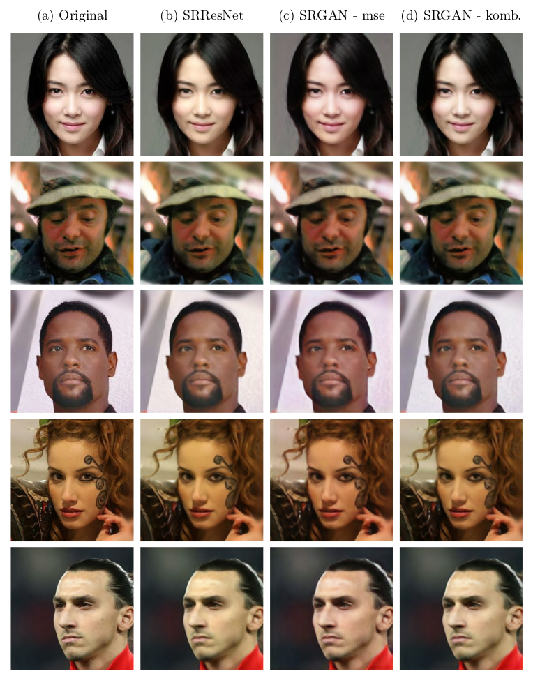

# SRGAN

This project is implemented for PSIML6 course and than extended for my seminar work at university. 

In this project I have implemented SRGAN (Super Resolution Generative Adversarial Network) for image super resolution on CelebaHQ dataset and tried out different configurations of the netwirk and loss functions. 

## Files

- `SRResNet.ipynb` - SRResNet implementation (just generator)
- `SRGAN.ipynb` - SRGAN implementation (generator and discriminator)
- `SRGAN_combined.ipynb` - SRGAN implementation (generator and discriminator) with combined loss function 
- `seminarski.pdf` - seminar work (in Serbian)

## Results

Here is the very brief overview of the results I got on images from test set. For more details regarding whole project and results, check out the seminar work.

